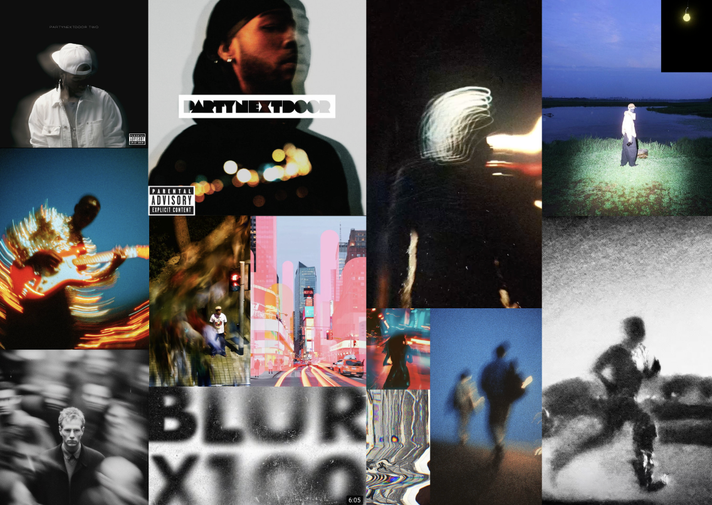

# PARTYNEXTDOOR—Expérience immersive & Cover Generator

Site web immersif dédié au nouvel album 2024 de PARTYNEXTDOOR, développé avec Next.js (App Router). Le site propose une landing page dynamique, une section discographie complète retraçant toute la carrière de l'artiste, ainsi qu'un générateur de pochettes d'album interactif permettant de créer des designs personnalisés inspirés de l'esthétique OVO et du moodboard créé pour le projet.



## Prérequis

- Node.js ≥ 18
- pnpm (recommandé). Adaptez les commandes si vous préférez npm, yarn ou bun.

## Installation & développement

```bash
# Installer les dépendances
pnpm install

# Lancer le serveur de dev
pnpm dev
```

Rendez-vous sur [http://localhost:3000](http://localhost:3000) ou bien <https://party-next-door-cover.vercel.app/> pour voir le site. La page principale est rendue depuis `app/page.tsx` et hot-reload automatiquement.

## Scripts utiles

| Commande     | Description                             |
| ------------ | --------------------------------------- |
| `pnpm dev`   | Serveur Next.js en mode développement   |
| `pnpm build` | Build production (Next.js + TypeScript) |
